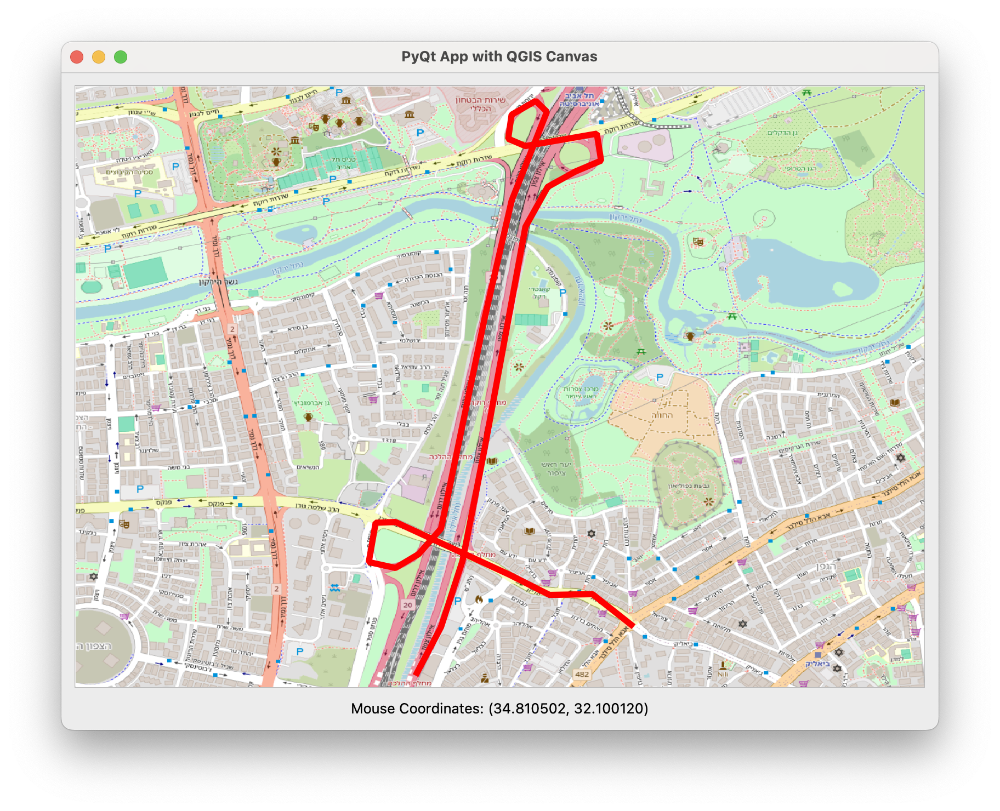

# Stand Alone QGIS App on Mac

This README provides instructions for running the Example app for QGIS on a Mac as a standalone application.

## About the App

Currently, the app is a proof of concept. It tracks the mouse coordinates and adds a GeoJSON file.



## Prerequisites

Before you begin, ensure you have the following installed:
- QGIS 3.x
- Python 3.x
- Miniconda 

## Environment installation
To set up the environment and install QGIS within Conda, follow these steps:

1. Create a new Conda environment named `gis_env`:
    ```sh
    conda create --name gis_env
    ```

2. Activate the newly created environment:
    ```sh
    conda activate gis_env
    ```

3. Install QGIS within the Conda environment:
    ```sh
    conda install -c conda-forge qgis
    ```
## Running the Application

To run the standalone QGIS application, execute the following command:
```sh
python main.py
```

## Contributing

Contributions are welcome! Please fork the repository and submit a pull request.


## Contact

For any questions or support, please open an issue on the GitHub repository.
